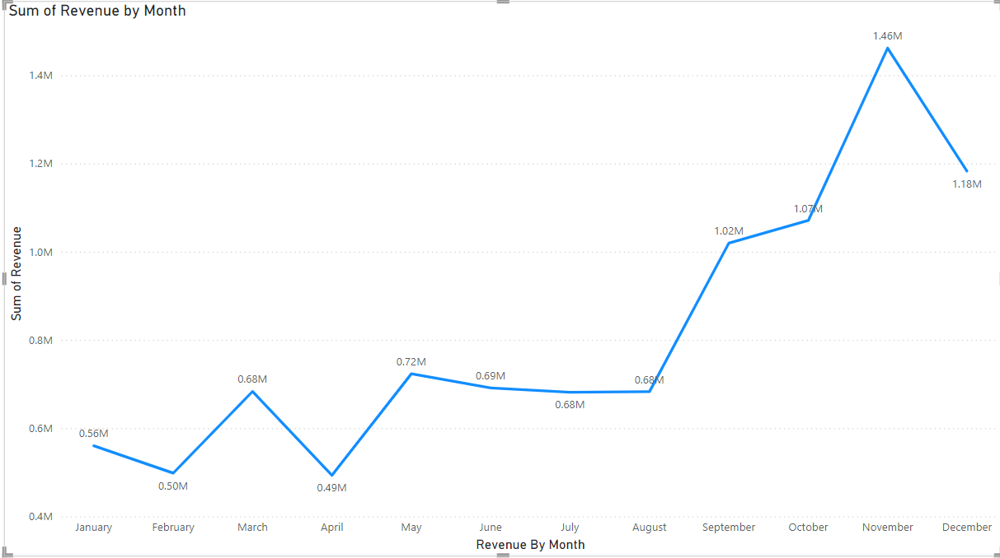
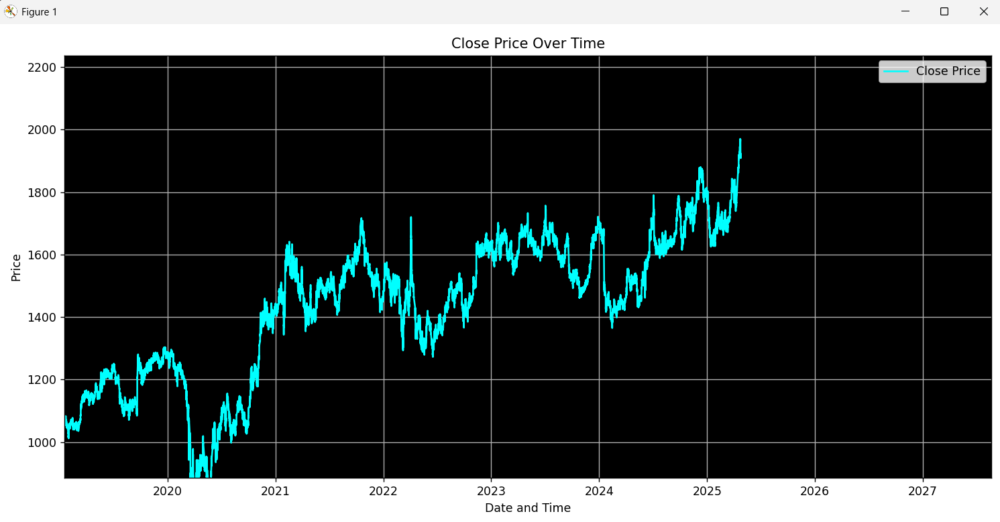
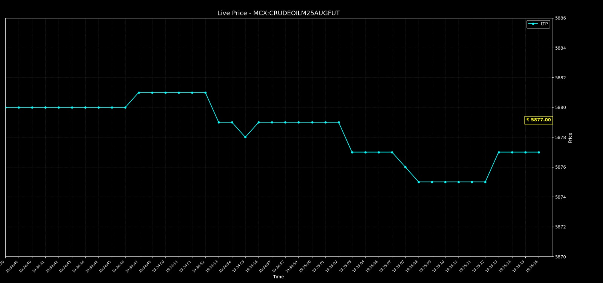
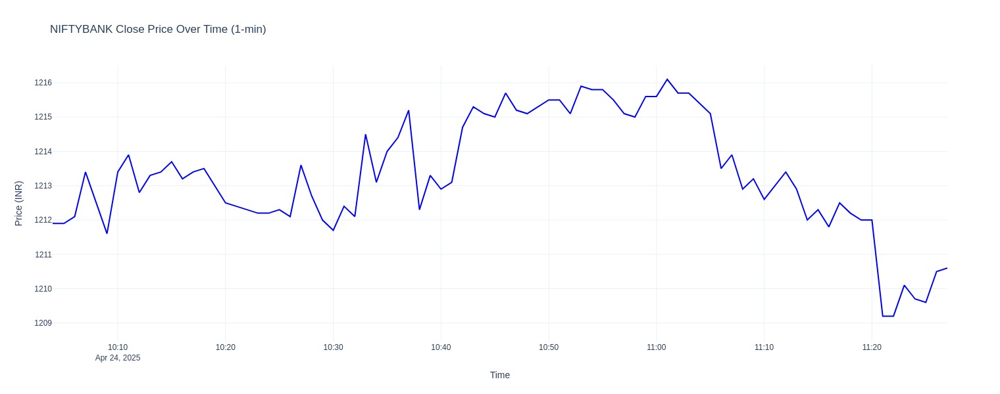
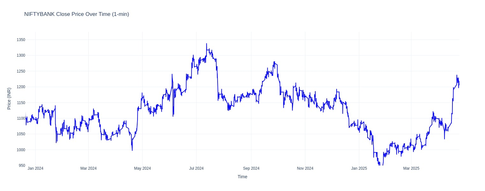

# 📈 RealTime-Market-Insight

**RealTime-Market-Insight** is a data science project that fetches **live stock market data** using APIs and WebSockets to provide real-time analytics, test trading strategies on historical data, and visualize financial trends using interactive charts.

---

## 🚀 Features

- Fetches **live stock prices** (e.g., Crude Oil, Nifty).
- Generates **line charts** for price movements and monthly revenue.
- Connects to real-time financial APIs using **WebSocket** and **REST API**.
- Displays **real-time updates** and **historical fluctuations**.

---

## 🛠️ Tech Stack

- Python  
- WebSocket API  
- REST API  
- Matplotlib / Plotly / Seaborn (Charting)  
- Pandas, NumPy  
- Jupyter Notebook  

---

## 📊 Output Screenshots  
All output images are located in the `images/` folder.

### 📌 Monthly Revenue Summary (Line Chart)  

---

### 📌 Price Close Line Chart  

---

### 📌 Live Price using API (Crude Oil)  

---

### 📌 Nifty 1-Minute Time Frame Chart  

---

### 📌 Nifty Price Fluctuation (Jan 2024 to Mar 2025)  

---

## 🔮 Future Enhancements

- Train **ML/DL models** to predict future price movements.
- Add **auto trading bot** to simulate or execute trades.
- Build a **dashboard** using React or Streamlit for user interaction.
- Integrate **news sentiment analysis** to gauge market impact.

---

> 🤝 Contributions are welcome! Feel free to open issues or submit pull requests to enhance this project.
